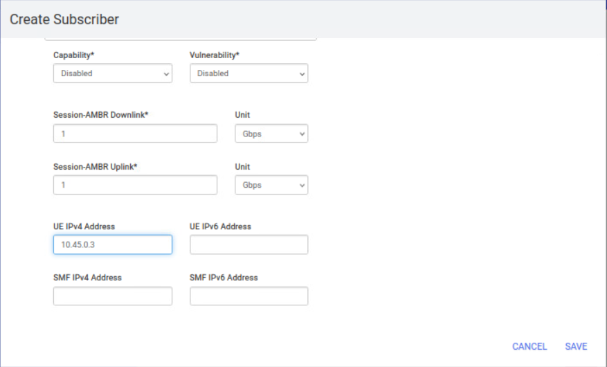
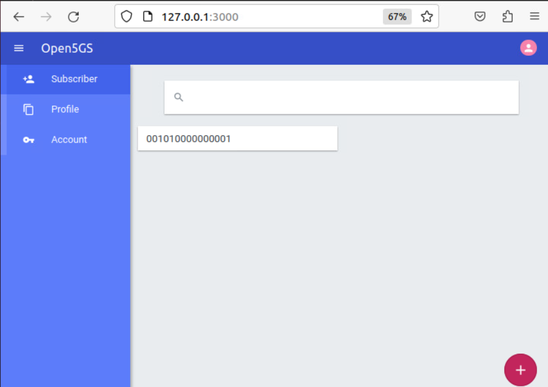

# Virt-manager and Openvswitch 

```bash 
sudo apt install virt-manager -y
```

```bash
sudo apt install openvswitch-switch -y 
```

```bash
sudo ovs-vsctl add-br br0 
```
```bash
sudo apt install net-tools -y 
sudo ifconfig br0 192.168.233.1/24 
sudo sysctl -w net.ipv4.ip_forward=1
sudo iptables -t nat -A POSTROUTING -s 192.168.233.0/24 -o ens160 -j MASQUERADE
```

```bash
sudo ovs-vsctl add-port br0 cp -- set Interface cp type=internal
sudo ovs-vsctl add-port br0 up -- set Interface up type=internal
sudo ovs-vsctl add-port br0 ue -- set Interface ue type=internal
sudo ovs-vsctl add-port br0 gnb -- set Interface gnb type=internal
```


# Open5GS - UP 


```bash
sudo apt update and sudo apt upgrade -y 
sudo apt install openssh-server -y 
```

**Remember to make a snapshot**

## Getting MongoDB

* Import the public key used by the package management system.

```bash
sudo apt update
sudo apt install wget gnupg -y
wget -qO - https://www.mongodb.org/static/pgp/server-6.0.asc | sudo apt-key add -

```

* Create the list file /etc/apt/sources.list.d/mongodb-org-6.0.list for your version of Ubuntu.

```bash
echo "deb [ arch=amd64,arm64 ] https://repo.mongodb.org/apt/ubuntu focal/mongodb-org/6.0 multiverse" | sudo tee /etc/apt/sources.list.d/mongodb-org-6.0.list

```

* Install the MongoDB packages.

```bash
sudo apt update 
sudo apt install -y mongodb-org
sudo systemctl start mongod
sudo systemctl enable mongod
```


## Getting Open5GS

* Ubuntu makes it easy to install Open5GS as shown below.

```bash 
sudo add-apt-repository ppa:open5gs/latest
sudo apt update
sudo apt install open5gs -y
```


* Modify the config files for UPF. This is only for the User Plane

```bash
cd install/etc/open5gs
```


```bash
sudo nano upf.yaml
```

```diff
upf:
    pfcp:
-      - addr: 127.0.0.7
+      - addr: 192.168.233.4
    gtpu:
-      - addr: 127.0.0.7
+      - addr: 192.168.233.4
    subnet:
      - addr: 10.45.0.1/16
      - addr: 2001:db8:cafe::1/48
    metrics:
      - addr: 127.0.0.7
        port: 9090
```


* Restart the UPF service

```bash
sudo systemctl restart open5gs-upf.service
```

* Check that the upf service is running properly


```bash
sudo systemctl status open5gs-upf.service
```

* Allow UE network traffic to access the internet. 

```bash
sudo sysctl -w net.ipv4.ip_forward=1
sudo iptables -t nat -A POSTROUTING -s 10.45.0.0/16 ! -o ogstun -j MASQUERADE
```


# Open5GS - CP 

## Getting MongoDB

* Import the public key used by the package management system.

```bash
sudo apt update
sudo apt install wget gnupg -y
wget -qO - https://www.mongodb.org/static/pgp/server-6.0.asc | sudo apt-key add -

```

* Create the list file /etc/apt/sources.list.d/mongodb-org-6.0.list for your version of Ubuntu.

```bash
echo "deb [ arch=amd64,arm64 ] https://repo.mongodb.org/apt/ubuntu focal/mongodb-org/6.0 multiverse" | sudo tee /etc/apt/sources.list.d/mongodb-org-6.0.list

```

* Install the MongoDB packages.

```bash
sudo apt update 
sudo apt install -y mongodb-org
sudo systemctl start mongod
sudo systemctl enable mongod
```


## Getting Open5GS

* Ubuntu makes it easy to install Open5GS as shown below.

```bash 
sudo add-apt-repository ppa:open5gs/latest
sudo apt update
sudo apt install open5gs -y
```

* Modify the config files for AMF and SMF. This is only for the control Plane

```bash
cd install/etc/open5gs
```


```bash
sudo nano amf.yaml
```

```diff
amf:
    sbi:
      - addr: 127.0.0.5
        port: 7777
    ngap:
-      - addr: 127.0.0.5
+      - addr: 192.168.233.2
    metrics:
      - addr: 127.0.0.5
        port: 9090
    guami:
      - plmn_id:
-          mcc: 999
-          mnc: 70
+          mcc: 001
+          mnc: 01
        amf_id:
          region: 2
          set: 1
    tai:
      - plmn_id:
-          mcc: 999
-          mnc: 70
+          mcc: 001
+          mnc: 01
+        tac: 1
    plmn_support:
      - plmn_id:
-          mcc: 999
-          mnc: 70
+          mcc: 001
+          mnc: 01
        s_nssai:
          - sst: 1
    security:
        integrity_order : [ NIA2, NIA1, NIA0 ]
        ciphering_order : [ NEA0, NEA1, NEA2 ]
    network_name:
        full: Open5GS
    amf_name: open5gs-amf0
```


```bash
sudo nano smf.yaml
```


```diff
smf:
    sbi:
      - addr: 127.0.0.4
        port: 7777
    pfcp:
-      - addr: 127.0.0.4
-      - addr: ::1
+      - addr: 192.168.233.3
+      #- addr: ::1
    gtpc:
      - addr: 127.0.0.4
-      - addr: ::1
+      #- addr: ::1
    gtpu:
      - addr: 127.0.0.4
-      - addr: ::1
+      #- addr: ::1
    metrics:
      - addr: 127.0.0.4
        port: 9090
    subnet:
      - addr: 10.45.0.1/16
      - addr: 2001:db8:cafe::1/48
    dns:
      - 8.8.8.8
      - 8.8.4.4
      - 2001:4860:4860::8888
      - 2001:4860:4860::8844
    mtu: 1400
    ctf:
      enabled: auto
    freeDiameter: /home/cp/open5gs/install/etc/freeDiameter/smf.conf


upf:
    pfcp:
-      - addr: 127.0.0.7
+      - addr: 192.168.233.4

```


* Restart the AMF and SMF service

```bash
sudo systemctl restart open5gs-amf.service
sudo systemctl restart open5gs-smf.service
```

* Check that the AMF and SMF service is running properly


```bash
sudo systemctl status open5gs-amf.service
sudo systemctl status open5gs-smf.service
```


## Building the WebUI of Open5GS

Node.js is required to build WebUI of Open5GS

```bash
sudo apt install curl -y
curl -fsSL https://deb.nodesource.com/setup_18.x | sudo -E bash -
sudo apt install nodejs
```

* Install the dependencies to run WebUI

```bash
cd webui
npm ci
```

* The WebUI runs as an npm script.

```bash
npm run dev &
```

## Register Subscriber Information

Connect to http://127.0.0.1:3000 and login with admin account.

Username : admin
Password : 1423

You can change the password after login 

<p align="center">
  
</p>


<p align="center">
  
</p>


<p align="center">
  
</p>

<p align="center">
  
</p>


<p align="center">
  
</p>


# UERANSIM - gNB

## Getting the UERANSIM

```bash
sudo apt update and sudo apt upgrade -y 
sudo apt install openssh-server -y 
sudo apt install git -y
```

* Clone repo 

```bash 
cd ~
git clone https://github.com/aligungr/UERANSIM
cd UERANSIM
```

* Install the required dependencies 

```bash 
sudo apt install make
sudo apt install gcc
sudo apt install g++
sudo apt install libsctp-dev lksctp-tools
sudo apt install iproute2
sudo snap install cmake --classic
```

## Build UERANSIM

```bash 
cd ~/UERANSIM
make
```

## gNB Configuration

```bash 
cd config
sudo cp open5gs-gnb.yaml open5gs-gnb1.yaml
sudo nano open5gs-gnb1.yaml
```

```diff
-mcc: '999'          # Mobile Country Code value
+mcc: '001'          # Mobile Country Code value

-mnc: '70'           # Mobile Network Code value (2 or 3 digits)
+mnc: '01'           # Mobile Network Code value (2 or 3 digits)

nci: '0x000000010'  # NR Cell Identity (36-bit)
idLength: 32        # NR gNB ID length in bits [22...32]
+tac: 1              # Tracking Area Code

-linkIp: 127.0.0.1   # gNB's local IP address for Radio Link Simulation (Usually same with local IP)
-ngapIp: 127.0.0.1   # gNB's local IP address for N2 Interface (Usually same with local IP)
-gtpIp: 127.0.0.1    # gNB's local IP address for N3 Interface (Usually same with local IP)

+linkIp: 192.168.233.5   # gNB's local IP address for Radio Link Simulation (Usually same with local IP)
+ngapIp: 192.168.233.5   # gNB's local IP address for N2 Interface (Usually same with local IP)
+gtpIp: 192.168.233.5    # gNB's local IP address for N3 Interface (Usually same with local IP)


# List of AMF address information
amfConfigs:
-  - address: 127.0.0.5
+  - address: 192.168.233.2
    port: 38412

# List of supported S-NSSAIs by this gNB
slices:
  - sst: 1

# Indicates whether or not SCTP stream number errors should be ignored.
ignoreStreamIds: true```


## Start using the gNB - UERANSIM 

After completing configurations and setups, now you can start using UERANSIM.
```

Run the following command to start the gNB:

```bash 
cd ..
./build/nr-gnb -c config/open5gs-gnb1.yaml
```


# UERANSIM - UE

## Getting the UERANSIM

```bash
sudo apt update and sudo apt upgrade -y 
sudo apt install openssh-server -y 
sudo apt install git -y
```

* Clone repo 

```bash 
cd ~
git clone https://github.com/aligungr/UERANSIM
cd UERANSIM
```

* Install the required dependencies 

```bash 
sudo apt install make
sudo apt install gcc
sudo apt install g++
sudo apt install libsctp-dev lksctp-tools
sudo apt install iproute2
sudo snap install cmake --classic
```

## Build UERANSIM

```bash 
cd ~/UERANSIM
make
```

## UE Configuration

```bash 
cd config
sudo cp open5gs-ue.yaml open5gs-ue1.yaml
sudo nano open5gs-ue1.yaml
```

```diff
# IMSI number of the UE. IMSI = [MCC|MNC|MSISDN] (In total 15 digits)
-supi: 'imsi-999700000000001'
+supi: 'imsi-001010000000001'
# Mobile Country Code value of HPLMN
-mcc: '999'
+mcc: '001'
# Mobile Network Code value of HPLMN (2 or 3 digits)
-mnc: '70'
+mnc: '01'

# Permanent subscription key
key: '465B5CE8B199B49FAA5F0A2EE238A6BC'
# Operator code (OP or OPC) of the UE
op: 'E8ED289DEBA952E4283B54E88E6183CA'
# This value specifies the OP type and it can be either 'OP' or 'OPC'
opType: 'OPC'
# Authentication Management Field (AMF) value
amf: '8000'
# IMEI number of the device. It is used if no SUPI is provided
imei: '356938035643803'
# IMEISV number of the device. It is used if no SUPI and IMEI is provided
imeiSv: '4370816125816151'

# List of gNB IP addresses for Radio Link Simulation
gnbSearchList:
-  - 127.0.0.1
+  - 192.168.233.5

# UAC Access Identities Configuration
uacAic:
  mps: false
  mcs: false

# UAC Access Control Class
uacAcc:
  normalClass: 0
  class11: false
  class12: false
  class13: false
  class14: false
  class15: false

# Initial PDU sessions to be established
sessions:
  - type: 'IPv4'
    apn: 'internet'
    slice:
      sst: 1

# Configured NSSAI for this UE by HPLMN
configured-nssai:
  - sst: 1

# Default Configured NSSAI for this UE
default-nssai:
  - sst: 1
    sd: 1

# Supported integrity algorithms by this UE
integrity:
  IA1: true
  IA2: true
  IA3: true

# Supported encryption algorithms by this UE
ciphering:
  EA1: true
  EA2: true
  EA3: true

# Integrity protection maximum data rate for user plane
integrityMaxRate:
  uplink: 'full'
  downlink: 'full'

```


## Start using the UE - UERANSIM 

After completing configurations and setups, now you can start using UERANSIM.

Run the following command to start the UE:

```bash 
cd ..
sudo ./build/nr-ue -c config/open5gs-ue1.yaml
```


