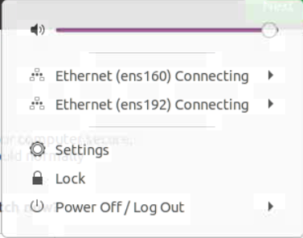
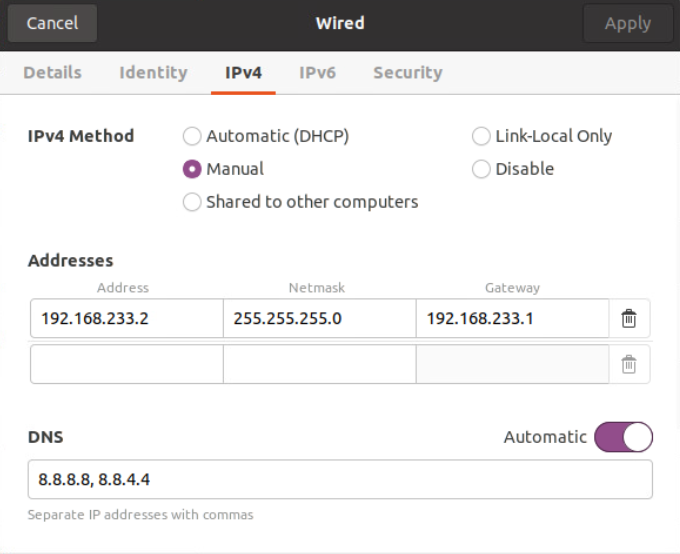
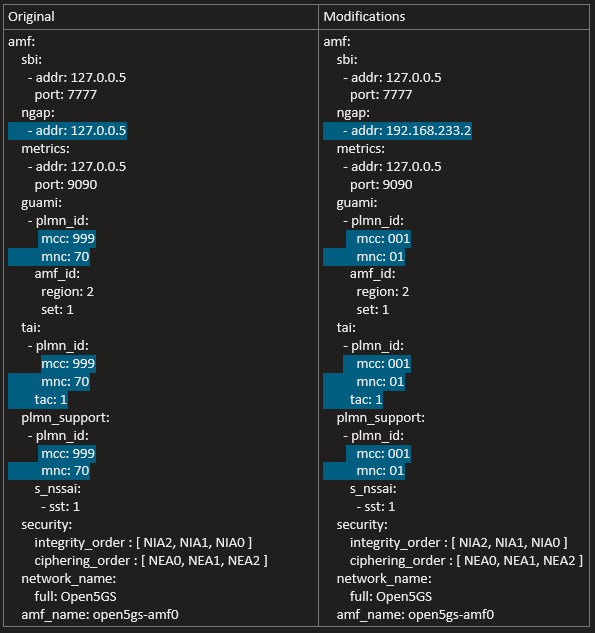
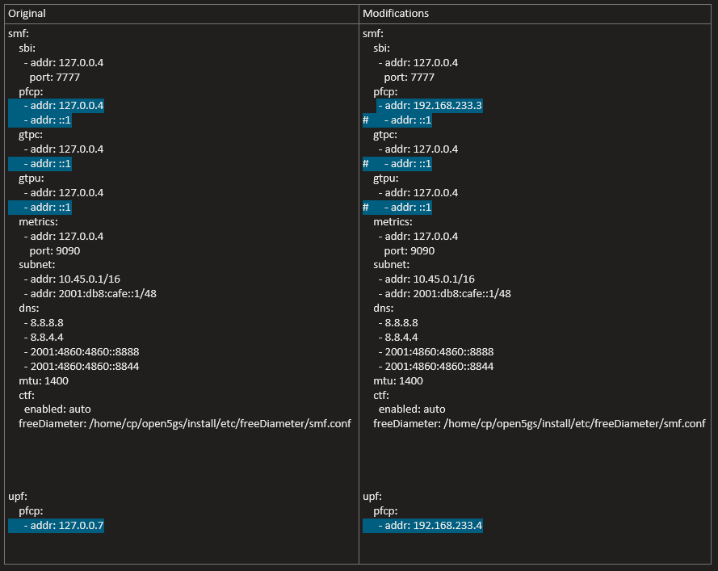
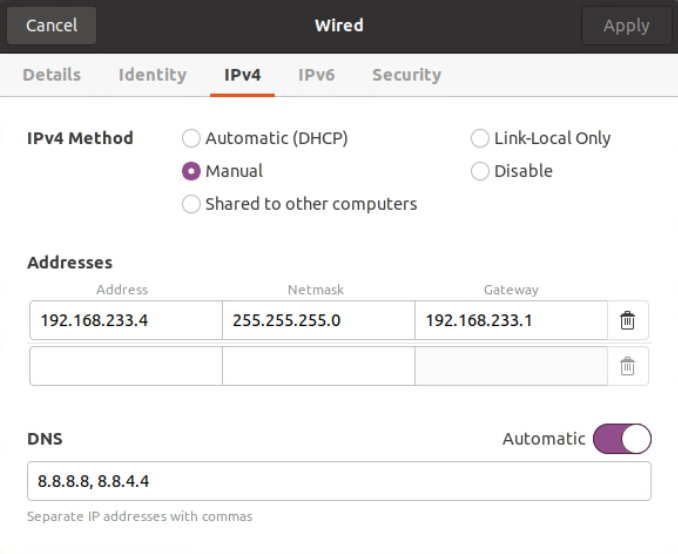
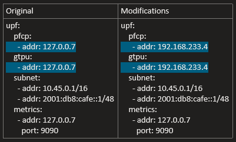

# Open5GS

## VMware ESXi

### Create a VM Control Plane 


<p align="center">
  
</p>

#### GUI 
1. In the Navigator pane on the left, click on the *Virtual Machines*  tab 
2. Click on *Create/Register VM* tab
3. In the *New Virtual Machine* wizard, select the following:
    1. Select Creating Type > Create a new virtual machine
    2. Select a name and Guest OS > 
        1. *Name*: CP
        2. *Compatibility*: ESXi 7.0 U2 virtual machine 
        3. *Guest OS family*: Linux 
        4. *Guest OS version*: Ubuntu Linux (64 bit)
    3. Select the inventory location where the virtual machine should be created
    4. Select the customize settings as it shows the figure below. The ISO used is ubuntu 20.04
    5. Finish the wizard and  power on the VM 

<p align="center">
  
</p>    


#### Modify the network configuration 

1. Select the CP virtual machine and *Open console in new window*
2. In the top right corner of the screen displayed on the console, click on the network icon
3. Click on *Settings* 
<p align="center">
  
</p>

4. In this case, the VM has two network connections. 
5. For the first network connection (ens160), we will click on the gear icon next to the connection name to access the settings for that connection and modify it based on the figure below. 
    1. *IPv4 Method*: Manual 
    2. Addresses: 
        1. *Address*: 192.168.233.2
        2. *Netmask*: 255.255.255.0
        3. *Gateway*: 192.168.233.1
        4. *DNS*: 8.8.8.8,8.8.4.4
6. For the second connection, we will click on the gear icon next to the connection name to access the settings for that connection and modify it based on the figure below. 
    1. *IPv4 Method*: Manual 
    2. Addresses: 
        1. *Address*: 192.168.233.3
        2. *Netmask*: 255.255.255.0
        3. *Gateway*: 192.168.233.1
        4. *DNS*: 8.8.8.8,8.8.4.4

<p align="center">
  
</p>


**Verify connectivity**
```bash
ping -c 2 192.168.233.1
ping -c 2 192.168.233.2
ping -c 2 google.com 
```

```bash 
sudo apt update && sudo apt upgrade -y
sudo apt install openssh-server -y 
```
Make sure to make a snapshot before proceeding with the setup


### Setup Control Plane and install Open5GS 

Using the  Gateway ssh session in MobaXterm, start an ssh session to access the CP VM and be able to setup the environment 


```bash 
gw@gw:~$ ssh cp@192.168.233.2
The authenticity of host '192.168.233.2 (192.168.233.2)' can't be established.
ECDSA key fingerprint is SHA256:MUwDhSddX/KvtsRJTC+pG1D1j2cPSbOzAsTSGxIW894.
Are you sure you want to continue connecting (yes/no/[fingerprint])? yes
Warning: Permanently added '192.168.233.2' (ECDSA) to the list of known hosts.
cp@192.168.233.2's password:
```


**Getting MongoDB**

**Import the public key used by the package management system.**
```bash
sudo apt update
sudo apt install wget gnupg -y
wget -qO - https://www.mongodb.org/static/pgp/server-6.0.asc | sudo apt-key add -
```

**Create the list file /etc/apt/sources.list.d/mongodb-org-6.0.list for your version of Ubuntu.**

```bash
echo "deb [ arch=amd64,arm64 ] https://repo.mongodb.org/apt/ubuntu focal/mongodb-org/6.0 multiverse" | sudo tee /etc/apt/sources.list.d/mongodb-org-6.0.list
```

**Install the MongoDB packages.**

```bash
sudo apt update 
sudo apt install -y mongodb-org
sudo systemctl start mongod
sudo systemctl enable mongod
mongo
sudo apt install mongodb-clients -y 
```


**Setting up TUN device (not persistent after rebooting)**

**Create the TUN device with the interface name ogstun.**

```bash
sudo ip tuntap add name ogstun mode tun
sudo ip addr add 10.45.0.1/16 dev ogstun
sudo ip link set ogstun up
```
**Building Open5GS**

**Install the dependencies for building the source code.**
```bash
sudo apt install python3-pip python3-setuptools python3-wheel ninja-build build-essential flex bison git cmake libsctp-dev libgnutls28-dev libgcrypt-dev libssl-dev libidn11-dev libmongoc-dev libbson-dev libyaml-dev libnghttp2-dev libmicrohttpd-dev libcurl4-gnutls-dev libnghttp2-dev libtins-dev libtalloc-dev meson -y
```

**Git clone**

```bash
git clone https://github.com/open5gs/open5gs
```

**To compile with meson**

```bash
cd open5gs
meson build --prefix=`pwd`/install
ninja -C build
```

**Run all test programs as below.**
```bash
 meson test-v
```


**You need to perform the installation process**
```bash
cd build
ninja install
cd../
```

**Modify the config files for AMF and SMF. This is only for the control Plane**

```bash 
cd install/etc/open5gs
```

**AMF File**

<p align="center">
  
</p>


**SMF File**

<p align="center">
  
</p>


**Run the Open5GS Network Functions 

```bash
 ./install/bin/open5gs-nrfd &
./install/bin/open5gs-scpd &
./install/bin/open5gs-amfd &
./install/bin/open5gs-smfd &
./install/bin/open5gs-ausfd &
./install/bin/open5gs-udmd &
./install/bin/open5gs-pcfd &
./install/bin/open5gs-nssfd &
 ./install/bin/open5gs-bsfd &
./install/bin/open5gs-udrd &
```

Run only the ones for CP. 

**Building the WebUI of Open5GS**

Node.js is required to build WebUI of Open5GS
```bash
 sudo apt install curl -y
 curl -fsSL https://deb.nodesource.com/setup_18.x | sudo -E bash -
 sudo apt install nodejs
```

**Install the dependencies to run WebUI**
```bash
 cd webui
```

**The WebUI runs as an npm script.**
```bash
npm run dev &
```

**Register Subscriber Information**

Connect to http://127.0.0.1:3000 and login with admin account.

Username : admin
Password : 1423

<p align="center">
  
</p>


### Create a VM for the User Plane 


<p align="center">
  
</p>

#### GUI 
1. In the Navigator pane on the left, click on the *Virtual Machines*  tab 
2. Click on *Create/Register VM* tab
3. In the *New Virtual Machine* wizard, select the following:
    1. Select Creating Type > Create a new virtual machine
    2. Select a name and Guest OS > 
        1. *Name*: UP
        2. *Compatibility*: ESXi 7.0 U2 virtual machine 
        3. *Guest OS family*: Linux 
        4. *Guest OS version*: Ubuntu Linux (64 bit)
    3. Select the inventory location where the virtual machine should be created
    4. Select the customize settings as it shows the figure below. The ISO used is ubuntu 20.04
    5. Finish the wizard and  power on the VM 

<p align="center">
  
</p>    

#### Modify the network configuration 

1. Select the UP virtual machine and *Open console in new window*
2. In the top right corner of the screen displayed on the console, click on the network icon
3. Click on *Settings* 
<p align="center">
  
</p>

4. In this case, the VM has only one network connections. 
5. For the only network connection (ens160), we will click on the gear icon next to the connection name to access the settings for that connection and modify it based on the figure below. 
    1. *IPv4 Method*: Manual 
    2. Addresses: 
        1. *Address*: 192.168.233.4
        2. *Netmask*: 255.255.255.0
        3. *Gateway*: 192.168.233.1
        4. *DNS*: 8.8.8.8,8.8.4.4


<p align="center">
  
</p>


**Verify connectivity**
```bash
ping -c 2 192.168.233.1
ping -c 2 192.168.233.4
ping -c 2 google.com 
```

```bash 
sudo apt update && sudo apt upgrade -y
sudo apt install openssh-server -y 
```

Make sure to make a snapshot before proceeding with the setup


### Setup User Plane 

Using the  Gateway ssh session in MobaXterm, start an ssh session to access the UP VM and be able to setup the environment 


```bash 
gw@gw:~$ ssh up@192.168.233.4
The authenticity of host '192.168.233.4 (192.168.233.4)' can't be established.
ECDSA key fingerprint is SHA256:gjef/x4K4K+qKokDY5ItTzM6BgUT0sCsVeOnSTzFtqs.
Are you sure you want to continue connecting (yes/no/[fingerprint])? yes
Warning: Permanently added '192.168.233.4' (ECDSA) to the list of known hosts.
up@192.168.233.4's password:
```


**Getting MongoDB**

**Import the public key used by the package management system.**
```bash
sudo apt update
sudo apt install wget gnupg -y
wget -qO - https://www.mongodb.org/static/pgp/server-6.0.asc | sudo apt-key add -
```

**Create the list file /etc/apt/sources.list.d/mongodb-org-6.0.list for your version of Ubuntu.**

```bash
echo "deb [ arch=amd64,arm64 ] https://repo.mongodb.org/apt/ubuntu focal/mongodb-org/6.0 multiverse" | sudo tee /etc/apt/sources.list.d/mongodb-org-6.0.list
```

**Install the MongoDB packages.**

```bash
sudo apt update 
sudo apt install -y mongodb-org
sudo systemctl start mongod
sudo systemctl enable mongod
mongo
sudo apt install mongodb-clients -y 
```


**Setting up TUN device (not persistent after rebooting)**

**Create the TUN device with the interface name ogstun.**

```bash
sudo ip tuntap add name ogstun mode tun
sudo ip addr add 10.45.0.1/16 dev ogstun
sudo ip link set ogstun up
```
**Building Open5GS**

**Install the dependencies for building the source code.**
```bash
sudo apt install python3-pip python3-setuptools python3-wheel ninja-build build-essential flex bison git cmake libsctp-dev libgnutls28-dev libgcrypt-dev libssl-dev libidn11-dev libmongoc-dev libbson-dev libyaml-dev libnghttp2-dev libmicrohttpd-dev libcurl4-gnutls-dev libnghttp2-dev libtins-dev libtalloc-dev meson -y
```

**Git clone**

```bash
git clone https://github.com/open5gs/open5gs
```

**To compile with meson**

```bash
cd open5gs
meson build --prefix=`pwd`/install
ninja -C build
```

**Run all test programs as below.**
```bash
 meson test-v
```


**You need to perform the installation process**
```bash
cd build
ninja install
cd../
```

**Modify the config files for UPF. This is only for the User Plane**

```bash 
cd install/etc/open5gs
```

**UPF File**

<p align="center">
  
</p>


**Run the Open5GS Network Functions 

```bash
./install/bin/open5gs-upfd &
```

Run only the ones for UP. 

Allow UE network traffic to access the internet.  

sudo sysctl -w net.ipv4.ip_forward=1
sudo iptables -t nat -A POSTROUTING -s 10.45.0.0/16 ! -o ogstun -j MASQUERADE


## Virt-Manager

