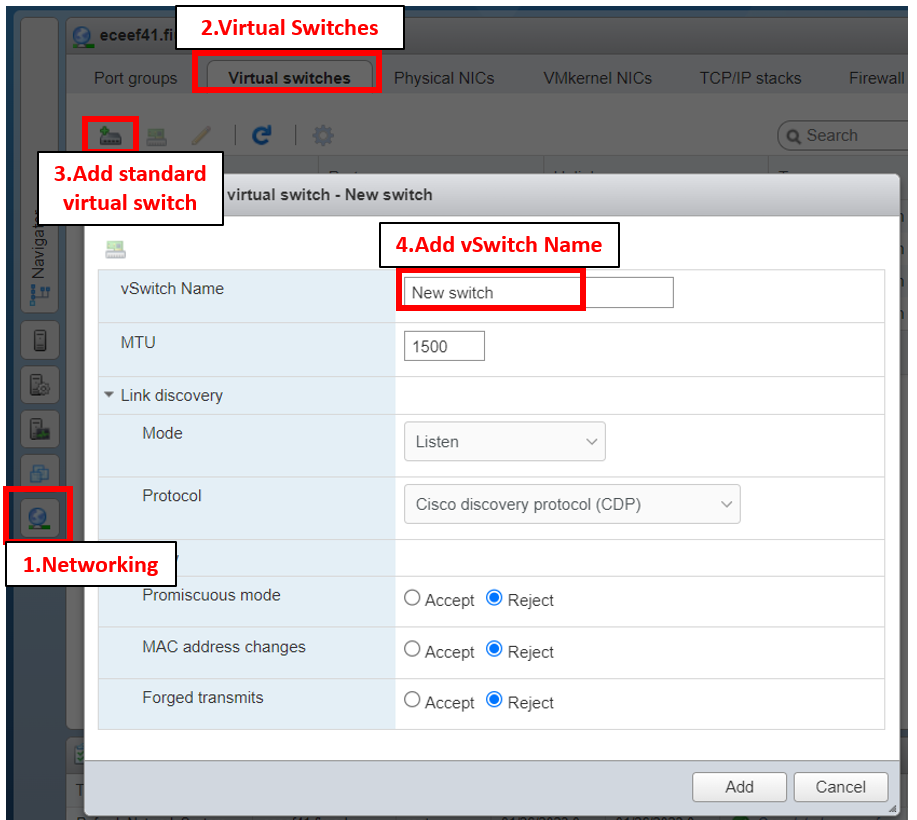
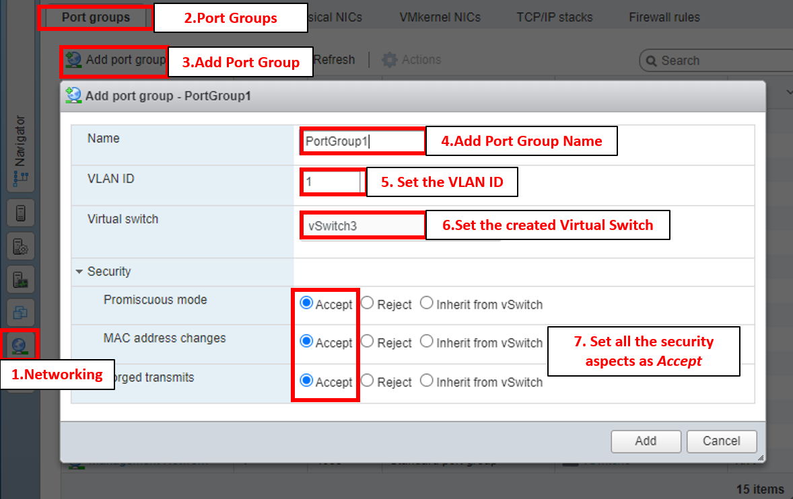
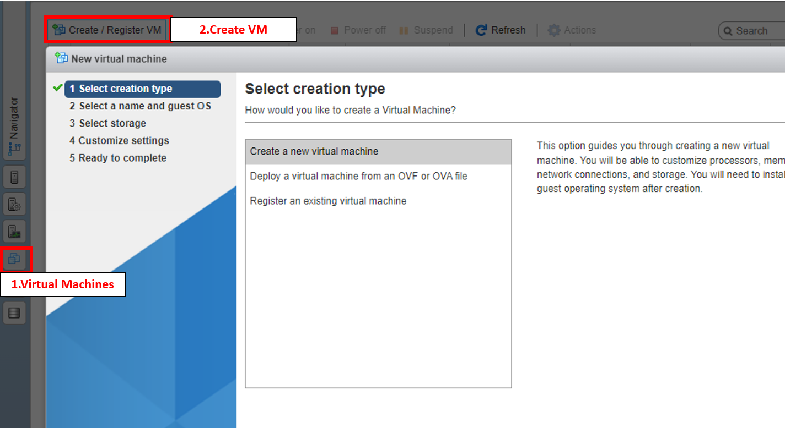
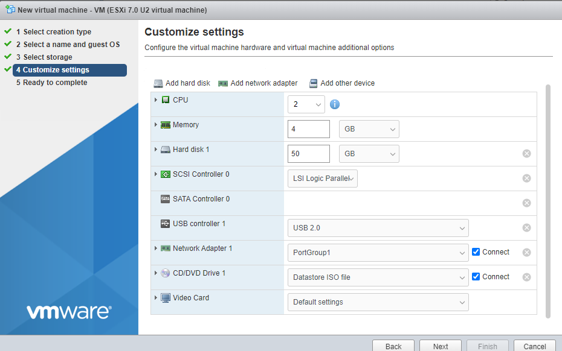
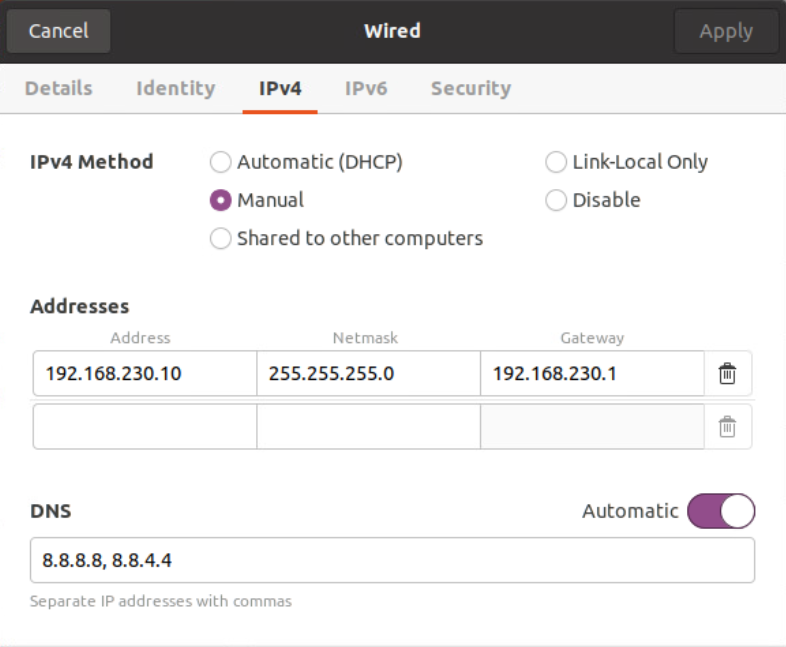

# Setup SDN environment #

This part of the project consists on several steps 

1. Create a virtual switch (vSwitch) within the ESXI environment 
2. Add a port group using the created vSwitch 
3. Create 3 VMS: One for the OpenvSwitch (OVS), Gateway, and Opendaylight (ODL) controller  
4. OVS setup
5. Gateway setup 
6. Opendaylight Setup 

## Create Virtual Switch ## 

For this approach, we created a Virtual Switch that is not connected to a Physical Network Interface Card (NIC) to isolate our virtual machines from the physical network, and preventing them from communicating with other systems. 
After getting into the to the VMWare ESXi environment 

1. Under the _Navigator_ bar, select the _Networking_ tab
2. Select the _Virtual switches_ tab 
3. Click on _Add standard virtual switch_ button 
4. Proceed to add the _vSwitch Name_ and leave other values as default unless you need to modify any other features. 



## Add a port group ## 

After creating the isolated Virtual switch (vSwitch3), we will proceed to create a Port Group and assign it to the vSwitch3. It's possible to create multiple port groups within the same vSwitch. 

Port groups allow us to logically carve up our virtual ports that are available on a particular vSwitch. In this case, we are creating VLANs that will allow us to assign VLAN tags to our virtual machines and segment our virutal network. For our testbed, we created a VLAN for each created VM to segment our network. 

The steps are very similar as creating a virtual switch:
1. Under the _Navigator_ bar, select the _Networking_ tab
2. Select the _Port Groups_ tab 
3. Click on _Add Port Group_ button 
4. Proceed to add the _Port Group Name_, assign the _VLAN ID_ of preference, select the recently created vswitch (_vSwitch3_), and set all the security features as _Accept_. 




## Create OVS and Gateway VM ##

Within the ESXi environment, we will proceed to create three VMs: one for OVS, one for Gateway, and one for ODL 


1. Under the _Navigator_ bar, select the _Virtual Machine_ tab
2. Select the _Create / Register VM_ tab 




After selecting the creation type (_Create a new virtual machine_), we will proceed to select the name and the guest OS in the next window. The following table represents the used values during the three VMs creation. 

<p align="center">
Select a name and guest OS 
</p>


|                  |             OVS             |           Gateway           |          Controller         |
|:----------------:|:---------------------------:|:---------------------------:|:---------------------------:|
|       Name       |             OVS             |           Gateway           |          Controller         |
|  Compatibility   | ESXI 7.0 U2 virtual machine | ESXI 7.0 U2 virtual machine | ESXI 7.0 U2 virtual machine |
|  Guest OS family |            Linux            |            Linux            |            Linux            |
| Guest OS Version |    Ubuntu Linux (64-bit)    |    Ubuntu Linux (64-bit)    |    Ubuntu Linux (64-bit)    |


<p align="center">
4. Customize Settings
</p>


|                   |         OVS        |       Gateway      |     Controller     |
|:-----------------:|:------------------:|:------------------:|:------------------:|
|        CPU        |          2         |          2         |          2         |
|       Memory      |         4GB        |         4GB        |         4GB        |
|    Hard Disk 1    |        50GB        |        50GB        |        50GB        |
| Network Adapter 1 |     PortGroup1     |     PortGroup1     |     PortGroup1     |
| CD/DVD Drive 1    | Datastore ISO File | Datastore ISO File | Datastore ISO File |
 
  


For more information about creating VMs in the ESXi environment. Please check the following tutorial:

https://support.kaspersky.com/KWTS/6.1/en-US/184243.htm 

## OVS setup ## 

Once the OVS VM has been created, we will start setting up the Openvswitch

1.Add IP address to the _ens160_ interface of the OVS VM using the Network Manager GUI 
```bash
Settings> Network> Ethernet (ens160) > "Gear Icon" > IPv4 
```



2. Install the Openvswitch 
```bash
sudo apt update 
sudo apt upgrade
sudo apt install openvswitch-switch -y 
```

3. Install other network utilies 

```bash
sudo apt install -y net-tools iproute2 bridge-utils iputils-ping tcpdump traceroute
```


