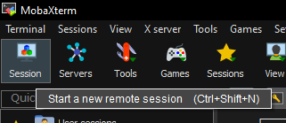

# Setup the SDN environment 

In this section, we provide a step-by-step guide on how to set up an SDN environment for the testbed in two different virtualization options: ESXi hypervisor and virt-manager. 
Our guide covers several essential steps, includig setting up the host networking, deploying an SDN controller, configuring SDN switches and testing the SDN environment. 


## VMware ESXi 

The ESXi deployment consists on several steps: 
1. Creating a virtual Switch 
2. Create Port Groups for the virtual switch 
3. Create and setup the Gateway VM 
4. Create and setup the Controller VM 
5. Create and setup Openvswitch VM 

### Create a virtual Switch 

There are two ways to create a virtual switch in the VMware ESXi: GUI and CLI. We provided the necessary steps in the following section. 

#### GUI 
1. In the Navigator pane on the left, click on the *Networking*  tab 
2. Click on *Virtual Switches* tab
3. To add a new switch, click on the *Add standard virtual switch* button
4. Enter a name for the new Switch in the *vSwitch Name* field. 

<p align="center">
  
</p>


#### CLI 
1. Connect to the ESXi server using SSH. Make sure that the *ESXi SSH* is enabled on the host. 

```bash
ssh root@$ESXiIP
```

2. Use the esxcli command to create the virtual switch. For this scenario, the switch will have the default setting, but it's possible to set the MTU, Link Discovery, and Security.

```bash 
esxcli network vswitch standard add -v vSwitch1
```
* **-v** &rarr; Specifies the vSwitch name.

### Create Port Groups for the created Virtual Switch 

#### GUI 
1. In the Navigator pane on the left, click on the *Networking*  tab 
2. Click on *Port Groups* tab
3. To add a new port group, click on the *Add port group* button
4. Enter the following attributes for the port group:
    1. Enter a name in the *Name* field
    2. Enter the corresponding VLAN ID in the *VLAN ID* field
    3. Select the created *Virtual Switch*
    4. Set all the *Security* policies to accept: *Promiscuous Mode*, *MAC adress changes*, and *Forged transmits*


 <p align="center">
  
</p>   

We are going to be creating a port group for each VM type. Use the following table as a reference to create the corresponding port groups. 

| Name             	| VLAN ID 	|
|------------------	|---------	|
| OVS-GW-1         	| 1       	|
| OVS-Controller-2 	| 2       	|
| OVS-CP-3         	| 3       	|
| OVS-UP-4         	| 4       	|
| OVS-gNB-5        	| 5       	|
| OVS-srsRAN-6     	| 6       	|
| OVS-UE-7         	| 7       	|

#### CLI 

1. Connect to the ESXi server using SSH. Make sure that the *ESXi SSH* is enabled on the host. 

```bash
ssh root@$ESXiIP
```

2. Use the esxcli command to create the port group. 


The following command allows to create new portgroups to a virtual switch in the ESXi envrionment

```bash 
esxcli network vswitch standard portgroup add --portgroup-name=OVS-GW-1 --vswitch-name=vSwitch1
```

* **--portgroup-name** &#8594; Specifies the name of the new port group that you want to create
* **--vswitch-name** &#8594; Specifies the name of the vSwitch where you want to create the new port group 


The following command allows to set the VLAN ID of the recently created port group. 


 * **-p** &#8594; Specifies the name of the port group that you want to modify
* **--vlan-id** &#8594; sets the VLAN ID of the port group 

```bash 
esxcli network vswitch standard portgroup set -p OVS-GW-1 --vlan-id 1
```

The following command allows to set the security policies for a port group using the ESXi CLI. 
```bash
esxcli network vswitch standard portgroup policy security set --portgroup-name=OVS-GW-1 -f true -m true -o true
```

* **--portgroup-name** &#8594; Specifies the name of the port group you want to configure.
* **-o true** &#8594; Sets the Promiscuous Mode policy which it's true in this case to accept. 
* **-m true** &#8594; Sets the MAC Address Changes policy, which in this case it's true to accept.
* **-f true** &#8594; Sets the Forged Transmits policy, which it's true in this case to accept.

We are going to be creating a port group for each time of VM. Use the following table as a reference to create the corresponding port groups. 

| Name             	| VLAN ID 	|
|------------------	|---------	|
| OVS-GW-1         	| 1       	|
| OVS-Controller-2 	| 2       	|
| OVS-CP-3         	| 3       	|
| OVS-UP-4         	| 4       	|
| OVS-gNB-5        	| 5       	|
| OVS-srsRAN-6     	| 6       	|
| OVS-UE-7         	| 7       	|

You can also use the following created commands to create all the required ports based on the table values

```bash
esxcli network vswitch standard portgroup add --portgroup-name=OVS-GW-1 --vswitch-name=vSwitch1
esxcli network vswitch standard portgroup set -p OVS-GW-1 --vlan-id 1
esxcli network vswitch standard portgroup policy security set --portgroup-name=OVS-GW-1 -f true -m true -o true
esxcli network vswitch standard portgroup add --portgroup-name=OVS-Controller-2 --vswitch-name=vSwitch1
esxcli network vswitch standard portgroup set -p OVS-Controller-2 --vlan-id 2
esxcli network vswitch standard portgroup policy security set --portgroup-name=OVS-Controller-2 -f true -m true -o true
esxcli network vswitch standard portgroup add --portgroup-name=OVS-CP-3 --vswitch-name=vSwitch1
esxcli network vswitch standard portgroup set -p OVS-CP-3 --vlan-id 3
esxcli network vswitch standard portgroup policy security set --portgroup-name=OVS-CP-3 -f true -m true -o true
esxcli network vswitch standard portgroup add --portgroup-name=OVS-UP-4 --vswitch-name=vSwitch1
esxcli network vswitch standard portgroup set -p OVS-UP-4 --vlan-id 4
esxcli network vswitch standard portgroup policy security set --portgroup-name=OVS-UP-4 -f true -m true -o true
esxcli network vswitch standard portgroup add --portgroup-name=OVS-gNB-5 --vswitch-name=vSwitch1
esxcli network vswitch standard portgroup set -p OVS-gNB-5 --vlan-id 5
esxcli network vswitch standard portgroup policy security set --portgroup-name=OVS-gNB-5 -f true -m true -o true
esxcli network vswitch standard portgroup add --portgroup-name=OVS-srsRAN-6 --vswitch-name=vSwitch1
esxcli network vswitch standard portgroup set -p OVS-srsRAN-6 --vlan-id 6
esxcli network vswitch standard portgroup policy security set --portgroup-name=OVS-srsRAN-6 -f true -m true -o true
esxcli network vswitch standard portgroup add --portgroup-name=OVS-UE-7 --vswitch-name=vSwitch1
esxcli network vswitch standard portgroup set -p OVS-UE-7 --vlan-id 7
esxcli network vswitch standard portgroup policy security set --portgroup-name=OVS-UE-7 -f true -m true -o true
```

### Create Gateway VM


<p align="center">
  
</p>

#### GUI 
1. In the Navigator pane on the left, click on the *Virtual Machines*  tab 
2. Click on *Create/Register VM* tab
3. In the *New Virtual Machine* wizard, select the following:
    1. Select Creating Type > Create a new virtual machine
    2. Select a name and Guest OS > 
        1. *Name*: GW
        2. *Compatibility*: ESXi 7.0 U2 virtual machine 
        3. *Guest OS family*: Linux 
        4. *Guest OS version*: Ubuntu Linux (64 bit)
    3. Select the inventory location where the virtual machine should be created
    4. Select the customize settings as it shows the figure below. The ISO used is ubuntu 20.04
    5. Finish the wizard and  power on the VM 

<p align="center">
  
</p>    


The gateway has two Network Adapters. The first network adapter is coming from the virtual switch that is connected to the physical NIC of the device where Vmware ESXi has been installed. The second network adapter is coming the virtual switch that is not connected to a NIC to keep the testbed network isolated from the institution network. We will proceed to configure this Network Adapter in future steps after configuring the Ubuntu VM for the Gateway. 
    


### Setup the GW VM 

#### Modify the network configuration 

1. Select the GW virtual machine and *Open console in new window*
2. In the top right corner of the screen displayed on the console, click on the network icon
3. Click on *Settings* 
<p align="center">
  
</p>

4. In this case, the VM has two network connections. For the first network connection (ens160), we will leave the default settings.
5. For the second connection, we will click on the gear icon next to the connection name to access the settings for that connection and modify it based on the figure below. 
    1. *IPv4 Method*: Manual 
    2. Addresses: 
        1. *Address*: 192.168.233.1
        2. *Netmask*: 255.255.255.0
        3. *Gateway*: 
        4. *DNS*: 8.8.8.8,8.8.4.4

<p align="center">
  
</p>

```bash 
sudo apt update 
sudo apt install openssh-server -y 
```

Start a new ssh session with the GW VM. I'm using MobaXterm 

<p align="center">
  
</p>

<p align="center">
  
</p>


Once the SSH session has been established, proceed to upgrade the system 

The following commands is to allow the second interface in the Gateway VM to allow traffic coming from the VMs connected to the OVS. 


```bash 
sudo sysctl -w net.ipv4.ip_forward=1
sudo iptables -t nat -A POSTROUTING -s 192.168.233.0/24 -o ens160 -j MASQUERADE
```

Also using this ssh session, it is possible to create another ssh session to access the VMs of our testbed. By using an ssh session, it allows us to have a centralized environment where we can copy and paste different commands. 


### Create the controller VM 


<p align="center">
  
</p>

#### GUI 
1. In the Navigator pane on the left, click on the *Virtual Machines*  tab 
2. Click on *Create/Register VM* tab
3. In the *New Virtual Machine* wizard, select the following:
    1. Select Creating Type > Create a new virtual machine
    2. Select a name and Guest OS > 
        1. *Name*: Controller
        2. *Compatibility*: ESXi 7.0 U2 virtual machine 
        3. *Guest OS family*: Linux 
        4. *Guest OS version*: Ubuntu Linux (64 bit)
    3. Select the inventory location where the virtual machine should be created
    4. Select the customize settings as it shows the figure below. The ISO used is ubuntu 20.04
    5. Finish the wizard and  power on the VM 
    
<p align="center">
  
</p>


### Setup the Controller VM 

#### Modify the network configuration 

1. Select the *Controller* virtual machine and *Open console in new window*
2. In the top right corner of the screen displayed on the console, click on the network icon
3. Click on *Settings* 
<p align="center">
  
</p>

4. In this case, the VM has two network connections. For the first network connection (ens160), we will leave the default settings.
5. For the second connection, we will click on the gear icon next to the connection name to access the settings for that connection and modify it based on the figure below. 
    1. *IPv4 Method*: Manual 
    2. Addresses: 
        1. *Address*: 192.168.230.1
        2. *Netmask*: 255.255.255.0
        3. *Gateway*: 
        4. *DNS*: 8.8.8.8,8.8.4.4

<p align="center">
  
</p>

```bash 
sudo apt update 
sudo apt install openssh-server -y 
```

Start a new ssh session with the GW VM. We are using MobaXterm  

<p align="center">
  
</p>

<p align="center">
  
</p>


The following commands is to allow the second interface in the Controller VM to allow traffic coming from the OVS. 


```bash 
sudo sysctl -w net.ipv4.ip_forward=1
sudo iptables -t nat -A POSTROUTING -s 192.168.230.0/24 -o ens160 -j MASQUERADE
```

Also using this ssh session, it is possible to create another ssh session to access the VMs of our testbed. By using an ssh session, it allows us to have a centralized environment where we can copy and paste different commands. 


    


#### Install Opendaylight 

```bash
sudo apt-get -y update
sudo apt-get -y upgrade
sudo apt-get -y install unzip
sudo apt-get -y install openjdk-8-jre
sudo update-alternatives --config java
ls -l /etc/alternatives/java
echo 'export JAVA_HOME=/usr/lib/jvm/java-8-openjdk-amd64/jre' >> ~/.bashrc
source ~/.bashrc
echo $JAVA_HOME
sudo apt install curl -y 
curl -XGET -O https://nexus.opendaylight.org/content/repositories/opendaylight.release/org/opendaylight/integration/karaf/0.8.4/karaf-0.8.4.zip
unzip karaf-0.8.4.zip
cd karaf-0.8.4/
./bin/karaf clean 

```

```bash 
opendaylight-user@root>feature:install odl-restconf  odl-mdsal-apidocs odl-dlux-core
```

**Connect to UI**
Connect to http://<IP>:8181/index.html#/login, using the credentials of admin/admin.


### Create a VM for the Openvswitch


<p align="center">
  
</p>


1. In the Navigator pane on the left, click on the *Virtual Machines*  tab 
2. Click on *Create/Register VM* tab
3. In the *New Virtual Machine* wizard, select the following:
    1. Select Creating Type > Create a new virtual machine
    2. Select a name and Guest OS > 
        1. *Name*: OVS
        2. *Compatibility*: ESXi 7.0 U2 virtual machine 
        3. *Guest OS family*: Linux 
        4. *Guest OS version*: Ubuntu Linux (64 bit)
    3. Select the inventory location where the virtual machine should be created
    4. Select the customize settings as it shows the figure below. The ISO used is ubuntu 20.04
    5. Finish the wizard and  power on the VM 
    
<p align="center">
  
</p>


### Setup the OVS VM 


#### Modify the network configuration 

1. Select the *OVS* virtual machine and *Open console in new window*
2. In the top right corner of the screen displayed on the console, click on the network icon
3. Click on *Settings* 
<p align="center">
  
</p>

4. In this case, the VM has seven network connections. Find the MAC address of the port that is connected to the SDN controller since it's the one that provides internet connection to the Openvswitch for install the necessary tools. In this case, our network connection is ens192
5. For the ens192, we will click on the gear icon next to the connection name to access the settings for that connection and modify it based on the figure below.
    1. *IPv4 Method*: Manual 
    2. Addresses: 
        1. *Address*: 192.168.230.5
        2. *Netmask*: 255.255.255.0
        3. *Gateway*:192.168.230.1 
        4. *DNS*: 8.8.8.8,8.8.4.4

<p align="center">
  
</p>


6. For the other six network connections, set them as *disable* as the *IPv4 Method*
7. After that reboot the vm to make the changes effective. 


    

```bash 
sudo apt update && sudo apt upgrade -y
sudo apt install openssh-server -y 
```

Using the ssh session in the SDN controller session in MobaXterm, proceed to start an ssh session to access the Openvswitch and be able to setup the environment 

```bash
controller@controller:~$ ssh ovs@192.168.230.5
The authenticity of host '192.168.230.5 (192.168.230.5)' can't be established.
ECDSA key fingerprint is SHA256:UM/hRiQmY5+SS2sCXCFG7E0JWbo5g23iLwbM6P8ucB0.
Are you sure you want to continue connecting (yes/no/[fingerprint])? yes
Warning: Permanently added '192.168.230.5' (ECDSA) to the list of known hosts.
ovs@192.168.230.5's password:
Welcome to Ubuntu 20.04.3 LTS (GNU/Linux 5.11.0-27-generic x86_64)

 * Documentation:  https://help.ubuntu.com
 * Management:     https://landscape.canonical.com
 * Support:        https://ubuntu.com/advantage

395 updates can be applied immediately.
2 of these updates are standard security updates.
To see these additional updates run: apt list --upgradable

Your Hardware Enablement Stack (HWE) is supported until April 2025.

The programs included with the Ubuntu system are free software;
the exact distribution terms for each program are described in the
individual files in /usr/share/doc/*/copyright.

Ubuntu comes with ABSOLUTELY NO WARRANTY, to the extent permitted by
applicable law.

ovs@ovs:~$
```

**Instal Openvswitch and necessary network tools**

```bash
sudo apt install openvswitch-switch -y
sudo apt install -y net-tools iproute2 bridge-utils iputils-ping tcpdump traceroute
```

**Create and configure the bridge**

```bash
sudo ovs-vsctl add-br br0

 sudo ip addr add 192.168.233.1/24 dev br0
 sudo ip link set br0 up

sudo sysctl -w net.ipv4.ip_forward=1
sudo iptables -t nat -A POSTROUTING -s 192.168.233.0/24 -o ens160 -j MASQUERADE
```

**Add interfaces to the switch**

```bash
sudo ovs-vsctl add-port br0 ens160
sudo ovs-vsctl add-port br0 ens161
sudo ovs-vsctl add-port br0 ens193
sudo ovs-vsctl add-port br0 ens224
sudo ovs-vsctl add-port br0 ens225
sudo ovs-vsctl add-port br0 ens256
```

**Verify that the interfaces have been added to the ovs**
```bash
sudo ovs-vsctl show 
```

**Set the external SDN controller**

```bash
sudo ovs-vsctl set-controller br0 tcp:192.168.230.1:6633
sudo ovs-vsctl set bridge br0 protocols=OpenFlow13
sudo ovs-ofctl add-flow br0 -O OpenFlow13 "table=0,priority=100,actions=normal"
sudo ovs-ofctl -O OpenFlow13 dump-flows br0
```

Reboot ovs VM after adding the ports, and proceed to add the following commands since it gets deleted after rebooting 


```bash
sudo sysctl -w net.ipv4.ip_forward=1
sudo iptables -t nat -A POSTROUTING -s 192.168.233.0/24 -o ens160 -j MASQUERADE
```


## Virt-manager
For this virtualization option, we tested on ubuntu 20.04. Therefore is recommended to use Ubuntu 20.04 to deploy virt-manager 

### Install virt-manager
**Update the machine**
```bash
sudo apt update
```

**Install virt-manager**
```bash
sudo apt install virt-manager
```

**Launch virt-manager**
```bash
sudo virt-manager
```

If you get an error saying that QEMU/KVM -Not connected, reboot the machine and try again to launch virt-manager 

### Install Openvswitch 


**Instal Openvswitch and necessary network tools**

```bash
sudo apt install openvswitch-switch -y
sudo apt install -y net-tools iproute2 bridge-utils iputils-ping tcpdump traceroute
```


**Create and configure the bridge**

```bash
sudo ovs-vsctl add-br br0

sudo ifconfig br0 192.168.233.1/24 

sudo sysctl -w net.ipv4.ip_forward=1
sudo iptables -t nat -A POSTROUTING -s 192.168.233.0/24 -o ens160 -j MASQUERADE
```

**Add ports to the switch**

```bash
sudo ovs-vsctl add-port br0 cp -- set Interface cp type=internal
sudo ovs-vsctl add-port br0 up -- set Interface up type=internal
sudo ovs-vsctl add-port br0 srsran -- set Interface srsran type=internal
sudo ovs-vsctl add-port br0 gnb -- set Interface gnb type=internal
sudo ovs-vsctl add-port br0 ue -- set Interface ue type=internal
```

**Verify that the interfaces have been added to the ovs**
```bash
sudo ovs-vsctl show 
```

**Set the external SDN controller**

```bash
sudo ovs-vsctl set-controller br0 tcp:192.168.230.1:6633
sudo ovs-vsctl set bridge br0 protocols=OpenFlow13
sudo ovs-ofctl add-flow br0 -O OpenFlow13 "table=0,priority=100,actions=normal"
sudo ovs-ofctl -O OpenFlow13 dump-flows br0
```
