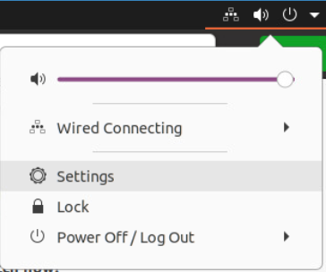
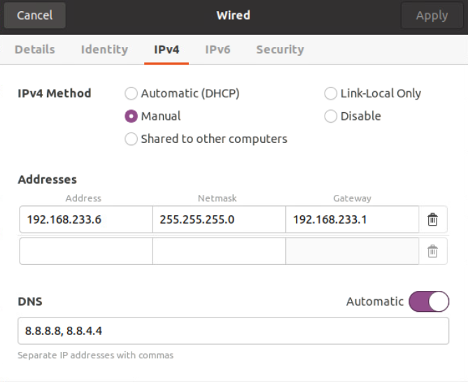
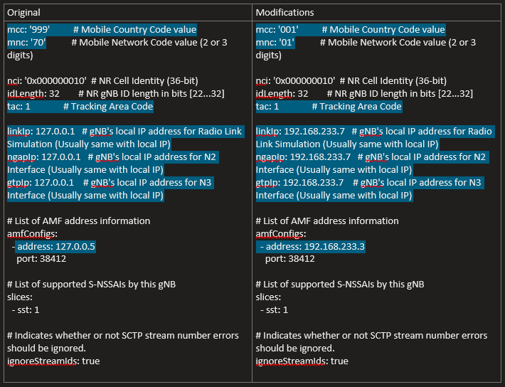
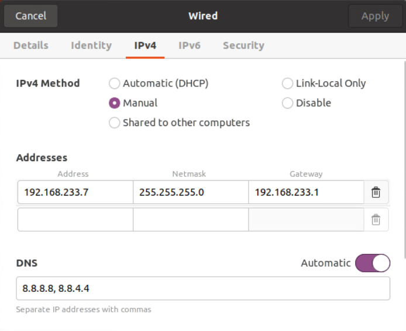
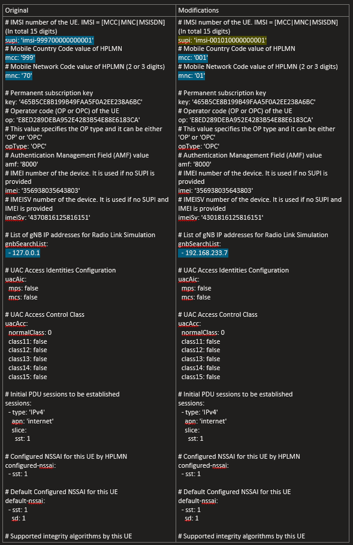

# UERANSIM

## VMware ESXi

### Create a VM for gNB


<p align="center">
  
</p>

#### GUI 
1. In the Navigator pane on the left, click on the *Virtual Machines*  tab 
2. Click on *Create/Register VM* tab
3. In the *New Virtual Machine* wizard, select the following:
    1. Select Creating Type > Create a new virtual machine
    2. Select a name and Guest OS > 
        1. *Name*: gNB
        2. *Compatibility*: ESXi 7.0 U2 virtual machine 
        3. *Guest OS family*: Linux 
        4. *Guest OS version*: Ubuntu Linux (64 bit)
    3. Select the inventory location where the virtual machine should be created
    4. Select the customize settings as it shows the figure below. The ISO used is ubuntu 20.04
    5. Finish the wizard and  power on the VM 

 

#### Modify the network configuration 

1. Select the gNB virtual machine and *Open console in new window*
2. In the top right corner of the screen displayed on the console, click on the network icon
3. Click on *Settings* 
<p align="center">
  
</p>   

4. In this case, the VM has only one network connections. 
5. For the only network connection (ens160), we will click on the gear icon next to the connection name to access the settings for that connection and modify it based on the figure below. 
    1. *IPv4 Method*: Manual 
    2. Addresses: 
        1. *Address*: 192.168.233.6
        2. *Netmask*: 255.255.255.0
        3. *Gateway*: 192.168.233.1
        4. *DNS*: 8.8.8.8,8.8.4.4


<p align="center">
  
</p>


**Verify connectivity**
```bash
ping -c 2 192.168.233.1
ping -c 2 192.168.233.6
ping -c 2 google.com 
```

```bash 
sudo apt update && sudo apt upgrade -y
sudo apt install openssh-server -y 
```

Make sure to make a snapshot before proceeding with the setup


### Setup gNB and install UERANSIM 

**To download UERANSIM**
```bash
cd ~
sudo apt install git -y
git clone https://github.com/aligungr/UERANSIM
cd UERANSIM
```

**Install required tools**
```bash
sudo apt install make
sudo apt install gcc -y
sudo apt install g++ -y
sudo apt install libsctp-dev lksctp-tools -y
sudo apt install iproute2
sudo snap install cmake --classic
```

**Build UERANSIM**
```bash
cd ~/UERANSIM
make
```

**Modify the config files**

```bash
cd UERANSIM/config 
sudo cp open5gs-gnb.yaml open5gs-gnb1.yaml
sudo nano open5gs-gnb1.yaml
```

<p align="center">
  
</p>

**Start the gNB**
```bash 
cd ..
./build/nr-gnb -c config/open5gs-gnb1.yaml
```


### Create a VM for UE


<p align="center">
  
</p>

#### GUI 
1. In the Navigator pane on the left, click on the *Virtual Machines*  tab 
2. Click on *Create/Register VM* tab
3. In the *New Virtual Machine* wizard, select the following:
    1. Select Creating Type > Create a new virtual machine
    2. Select a name and Guest OS > 
        1. *Name*: UE
        2. *Compatibility*: ESXi 7.0 U2 virtual machine 
        3. *Guest OS family*: Linux 
        4. *Guest OS version*: Ubuntu Linux (64 bit)
    3. Select the inventory location where the virtual machine should be created
    4. Select the customize settings as it shows the figure below. The ISO used is ubuntu 20.04
    5. Finish the wizard and  power on the VM 

 

#### Modify the network configuration 

1. Select the UE virtual machine and *Open console in new window*
2. In the top right corner of the screen displayed on the console, click on the network icon
3. Click on *Settings* 
<p align="center">
  
</p>   

4. In this case, the VM has only one network connections. 
5. For the only network connection (ens160), we will click on the gear icon next to the connection name to access the settings for that connection and modify it based on the figure below. 
    1. *IPv4 Method*: Manual 
    2. Addresses: 
        1. *Address*: 192.168.233.7
        2. *Netmask*: 255.255.255.0
        3. *Gateway*: 192.168.233.1
        4. *DNS*: 8.8.8.8,8.8.4.4


<p align="center">
  
</p>


**Verify connectivity**
```bash
ping -c 2 192.168.233.1
ping -c 2 192.168.233.7
ping -c 2 google.com 
```

```bash 
sudo apt update && sudo apt upgrade -y
sudo apt install openssh-server -y 
```


Make sure to make a snapshot before proceeding with the setup


### Setup UE and install UERANSIM 

**To download UERANSIM**
```bash
cd ~
sudo apt install git -y
git clone https://github.com/aligungr/UERANSIM
cd UERANSIM
```

**Install required tools**
```bash
sudo apt install make
sudo apt install gcc -y
sudo apt install g++ -y
sudo apt install libsctp-dev lksctp-tools -y
sudo apt install iproute2
sudo snap install cmake --classic
```

**Build UERANSIM**
```bash
cd ~/UERANSIM
make
```

**Modify the config files**

```bash
cd UERANSIM/config 
sudo cp open5gs-ue.yaml open5gs-ue1.yaml
sudo nano open5gs-ue1.yaml
```

<p align="center">
  
</p>

**Start the UE**
```bash 
cd ..
./build/nr-gnb -c config/open5gs-ue1.yaml
```