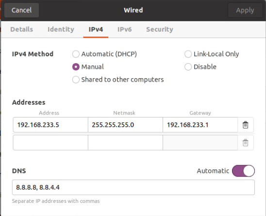

# srsRAN

## VMware ESXi

### Create a VM for srsRAN


<p align="center">
  
</p>

#### GUI 
1. In the Navigator pane on the left, click on the *Virtual Machines*  tab 
2. Click on *Create/Register VM* tab
3. In the *New Virtual Machine* wizard, select the following:
    1. Select Creating Type > Create a new virtual machine
    2. Select a name and Guest OS > 
        1. *Name*: srsRAN
        2. *Compatibility*: ESXi 7.0 U2 virtual machine 
        3. *Guest OS family*: Linux 
        4. *Guest OS version*: Ubuntu Linux (64 bit)
    3. Select the inventory location where the virtual machine should be created
    4. Select the customize settings as it shows the figure below. The ISO used is ubuntu 20.04
    5. Finish the wizard and  power on the VM 

 

#### Modify the network configuration 

1. Select the srsRAN virtual machine and *Open console in new window*
2. In the top right corner of the screen displayed on the console, click on the network icon
3. Click on *Settings* 
<p align="center">
  
</p>   

4. In this case, the VM has only one network connections. 
5. For the only network connection (ens160), we will click on the gear icon next to the connection name to access the settings for that connection and modify it based on the figure below. 
    1. *IPv4 Method*: Manual 
    2. Addresses: 
        1. *Address*: 192.168.233.5
        2. *Netmask*: 255.255.255.0
        3. *Gateway*: 192.168.233.1
        4. *DNS*: 8.8.8.8,8.8.4.4


<p align="center">
  
</p>


**Verify connectivity**
```bash
ping -c 2 192.168.233.1
ping -c 2 192.168.233.5
ping -c 2 google.com 
```

```bash 
sudo apt update && sudo apt upgrade -y
sudo apt install openssh-server -y 
```

Make sure to make a snapshot before proceeding with the setup


 ### Setup and install srsRAN

 #### ZeroMQ Installation 

 **Install the necessary library to build srsRAN**

 ```bash
sudo apt-get -y install autoconf automake build-essential ccache cmake cpufrequtils doxygen ethtool fort77 g++ gir1.2-gtk-3.0 git gobject-introspection gpsd gpsd-clients inetutils-tools libasound2-dev libboost-all-dev libcomedi-dev libcppunit-dev libfftw3-bin libfftw3-dev libfftw3-doc libfontconfig1-dev libgmp-dev libgps-dev libgsl-dev liblog4cpp5-dev libncurses5 libncurses5-dev libpulse-dev libqt5opengl5-dev libqwt-qt5-dev libsdl1.2-dev libtool libudev-dev libusb-1.0-0 libusb-1.0-0-dev libusb-dev libxi-dev libxrender-dev libzmq3-dev libzmq5 ncurses-bin python3-cheetah python3-click python3-click-plugins python3-click-threading python3-dev python3-docutils python3-gi python3-gi-cairo python3-gps python3-lxml python3-mako python3-numpy python3-numpy-dbg python3-opengl python3-pyqt5 python3-requests python3-scipy python3-setuptools python3-six python3-sphinx python3-yaml python3-zmq python3-ruamel.yaml swig wget
```

**Install libzmq**

```bash 
sudo apt-get install libzmq3-dev
git clone https://github.com/zeromq/libzmq.git
cd libzmq
./autogen.sh
./configure
make
sudo make install
sudo ldconfig
```

**Install czmq**

```bash
cd
git clone https://github.com/zeromq/czmq.git
cd czmq
./autogen.sh
./configure
make
sudo make install
sudo ldconfig
```

**Install UHD**
```bash
sudo apt install git -y
git clone https://github.com/EttusResearch/uhd
cd uhd
cd host
mkdir build
cd build
cmake ..
make 
make test
sudo make install
sudo ldconfig 
sudo /usr/local/lib/uhd/utils/uhd_images_downloader.py 
sudo uhd_find_devices
sudo uhd_usrp_probe 
```

**Install srsRAN**
```bash
sudo apt-get install build-essential cmake libfftw3-dev libmbedtls-dev libboost-program-options-dev libconfig++-dev libsctp-dev -y
git clone https://github.com/srsRAN/srsRAN.git
cd srsRAN
mkdir build
cd build
cmake ../
make
make test
sudo make install
srsran_install_configs.sh user
sudo ldconfig
```

